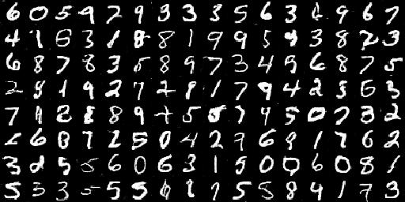

# DCGAN

generator和discriminator的良性竞争，相互制约，目标是提升generator生成图像的效果。

## 从随机向量生成真实图像
如何构建一个新的GAN网络?
> - 定义目标
> - 定义G的输入输出
> - 定义D的输入输出
> - 定义G和D的结构

G：随机向量->图像
> - 反卷积：与卷积操作的反向传播计算方法相同。[详见](DCGAN.ipynb)  
> - pooling层由fractional strided conv代替，避免过多信息损失。  
> - batch normalization  
> - 使用global pooling，不用全连接输出。  

D：G的输出, 真实图像分别输入->两个Prob
> strided conv   
>  使用 leakyReLU

训练10000步的结果：  

## Pix2Pix
与DCGAN不同，G输入为图像，使用U-Net生成图像；D的输入是一对图像一起输入，判断是否是一对。

## CycleGAN
处理非配对图像的翻译，Cycle在于A到B和B到A的转换是应该能够同时做到的。So，两个GAN，分别交换输入输出，损失两个GAN的损失和cycle consistency loss

## StarGAN
同样是成对图像，但是同时学习多个任务，生成器包含目标任务领域信息，判别器结果需要判别处理的任务领域类别。

## Text2Img
G：  
输入: 随机向量+文本编码    
输出: 图像

D：  
输入: 生成图像+文本编码  
输出: 图像文本是否匹配(secend)+图像是否真实(first)
