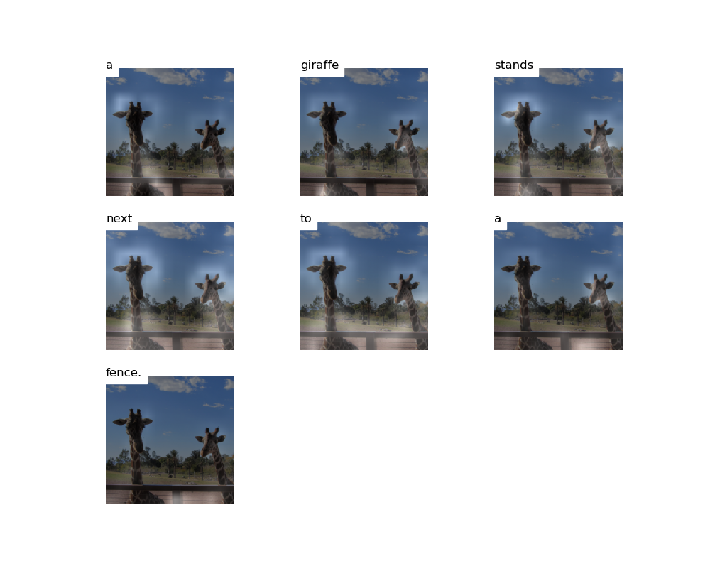

# Worth_doing

我本江湖饮鹤无，频年贳酒不能年。经筵闭户门深坐，簑笠行谁半醉眠。 -- DNN generated

名称 | 描述
--- | ---
[style transfer](style_tansfer/) | 使用预训练的vggnet，训练使内容损失和Gram Matrix计算出的风格损失最小化，详见项目文件夹
[image caption](image_caption/) | show and tell的tensorflow实现，模型可加入attention以及top-down lstm优化
[DCGAN](DCGAN/)、[DCGAN--face_generate](DCGAN--face_generate/) | 编写该模型实现MNIST数字图片生成，对Cycle、Pix2Pix等简述
[WGAN](WGAN/) | 对WGAN的原理，动机，问题分析，完成简单模型搭建和使用
[CGAN](CGAN/) | 对CGAN的原理分析，完成简单模型搭建，在MNIST中使用
[ACGAN](ACGAN/) | 对ACGAN的原理进行分析，完成简单模型搭建和face_generate的实验，对比DCGAN模型稳定性有一定提升
[Pix2Pix](Pix2Pix/) | 对Pix2Pix的原理进行分析，通过在CGAN基础上，加入U-Net和L1 loss，使用全卷积的patahGAN方法
[CycleGAN](CycleGAN/) | 对CycleGAN的原理简单分析，使用已用模型，对图片和视频分别进行性别转换，只做了模型使用部分
[Anime_generation](Anime_generation/) | 使用ACGAN的基本方法，加入sub pixel cnn和残差连接，对多特征生成问题进行处理，得到了相对较好的效果。但含某个特征的样本数量较少时，相应的generate效果较差。
[Yolo](Yolo/) | 使用预训练yolo模型，计算yolo output，使用non max suppression和score filtering，对输出的多类预测boxes进行筛选
[Face Recognition](FaceRecognition/) | 使用triplet loss训练多层inception block网络，实现对face image编码。encoding用于1：1的verification和1：k的recognition
[WritingShakespeare](WritingShakespeare/) | 模型很简单，utils对sample的处理，对train data的处理更有用
[DebiasWordVectors](DebiasWordVectors/) | 关键在算法，线性代数转换，使gender bias关于orthogonal axis对称
[sentence2Emoji](sentence2Emoji/) | average vector方法忽略了词序，而LSTM效果更好；使用pretrianed word vec，即使只有127条数据，也有较好的效果
[Translation](Translation/) | seq2seq model的常用data process，使用全局共享的layer进行部分计算，attention的简答实现
[TriggerWordDetection](TriggerWordDetection/) | 音频数据的处理方法，生成含Trigger Word的数据，同时使用Conv 1D将输入的长序列频谱图转换成较短长度的输入。注意，不要使用Bidirection model，因为模型要求的是“立即”反馈检测结果。
[CatVsDog](CatVsDog/) | 多层CNN，使用比较‘古老的’LRN+pool层建模。使用tf文件队列和batch API提高数据读取和预处理效率。
[DNN_中文分词](DNN_中文分词/) | 分别使用bilstm和CNN，在MSR数据集上进行分词训练，得到标记概率分布。由viterbi算法求解最优标记序列。算法部分过程有待优化，容易出现过拟合。
[FlappyBird](FlappyBird/) | 简单初窥DQN，对policy based model简单实现部分训练过程。
[古诗生成](古诗生成/) | 使用双层LSTM模型，在古诗数据集上训练50轮，得到比较有规律的效果，当然诗歌的意境是学不到的。
[DeepDream](DeepDream/) | 以增大某种特征提取tensor在原图中的显著程度，使用预训练的inception网络（必须是学习好的特征提取网络），以递归方式在不同尺度上，叠加梯度上升修改后的输入变量 X。
